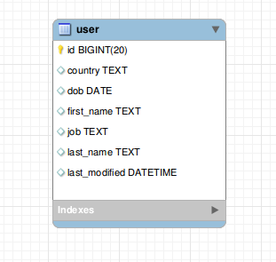

# solr-mysql-adventure

## Indexing _Mysql_ tables into _Solr_ (Batch Import)

### Sample Table Schema 

### Setup Solr

<ol>
<li><a href="https://lucene.apache.org/solr/downloads.html"> Download desired version of Solr</a></li>

<li>Unzip to your desired location</li>

<li><a href="https://dev.mysql.com/downloads/file/?id=498587">Download Mysql connector</a> and place the *.jar in <i>contrib/dataimporthandler/lib</i></li>
</ol>

### Solr Commands

Start Solr  - `./bin/solr start`

Stop Solr  - `./bin/solr stop`

Restart Solr -    `./bin/solr restart`

Create a new core *user* - `./bin/solr create -c user`

### Steps

1. Start Solr
2. Create a new core `user`, this will create a directory `user`(server/solr/user) 
3. You need to create `data-config.xml` inside `server/solr/user/conf`, here we need to add database configuration and entity config.

        <dataConfig><dataSource type="JdbcDataSource" driver="com.mysql.jdbc.Driver" url="jdbc:mysql://localhost:3306/solr_test" user="root" password="root" />
    <document>
        <entity name="user" pk="id" deltaImportQuery="SELECT id,first_name,last_name, job, country from user WHERE id='${dih.delta.id}'" deltaQuery="SELECT id,first_name,last_name, job, country FROM user  WHERE last_modified > '${dih.last_index_time}'" query="select id,first_name,last_name, job, country from user">
        <field column="id" name="id" />
        <field column="first_name" name="first_name"/>
        <field column="last_name" name="last_name"/>
        <field column="job" name="job"/>
        <field column="country" name="country"/>
        </entity>
    </document>
        </dataConfig>

4. You also need to edit `server/solr/user/conf/solrconfig.xml` and add following line blocks:
    
        <lib dir="../../contrib/dataimporthandler/lib" regex=".*\.jar" />
        <lib dir="../../dist/" regex="solr-dataimporthandler-.*\.jar" />`
        
        <requestHandler name="/dataimport" class="org.apache.solr.handler.dataimport.DataImportHandler">
            <lst name="defaults">
            <str name="config">data-config.xml</str>
            </lst>
        </requestHandler>

5. You also need to add field mapping in `server/solr/user/conf/managed.schema`    

        <field name="first_name" type="text_general" indexed="true" stored="true" />
        <field name="last_name" type="text_general" indexed="true" stored="true" />
        <field name="job" type="text_general" indexed="true" stored="true" />
        <field name="country" type="text_general" indexed="true" stored="true" />

6. Now restart the solr server.
7. Make a POST request for delta-import 
    
        curl 'http://localhost:8983/solr/user/dataimport?_=1610196841059&indent=on&wt=json' \
        -H 'Connection: keep-alive' \
        -H 'Accept: application/json, text/plain, */*' \
        -H 'DNT: 1' \
        -H 'X-Requested-With: XMLHttpRequest' \
        -H 'User-Agent: Mozilla/5.0 (X11; Linux x86_64) AppleWebKit/537.36 (KHTML, like Gecko) Chrome/87.0.4280.141 Safari/537.36' \
        -H 'Content-type: application/x-www-form-urlencoded' \
        -H 'Origin: http://localhost:8983' \
        -H 'Sec-Fetch-Site: same-origin' \
        -H 'Sec-Fetch-Mode: cors' \
        -H 'Sec-Fetch-Dest: empty' \
        -H 'Referer: http://localhost:8983/solr/' \
        -H 'Accept-Language: en-IN,en-US;q=0.9,en;q=0.8,hi-IN;q=0.7,hi;q=0.6,en-GB;q=0.5' \
        --data-raw 'command=delta-import&verbose=false&clean=false&commit=true&core=user&name=dataimport' \
        --compressed

8. Now query to find all Neurosurgeons living in India `http://localhost:8983/solr/user/select?q=country%3AIndia%20AND%20job%3ANeurosurgeon`

        {
            "responseHeader":{
                        "status":0,
                        "QTime":0,
                        "params":{
                        "q":"country:India AND job:Neurosurgeon"}},
                    "response":{"numFound":2,"start":0,"numFoundExact":true,"docs":[
                                {
                                    "country":["India"],
                                    "last_name":["Pacheco"],
                                    "id":"86813",
                                    "job":["Neurosurgeon"],
                                    "first_name":["Jesus"],
                                    "_version_":1688414340002086913
                                },
                                {
                                    "country":["India"],
                                    "last_name":["Clayton"],
                                    "id":"89267",
                                    "job":["Neurosurgeon"],
                                    "first_name":["Cheryl"],
                                    "_version_":1688414345436856320
                                }
                            ]
            }
        }

